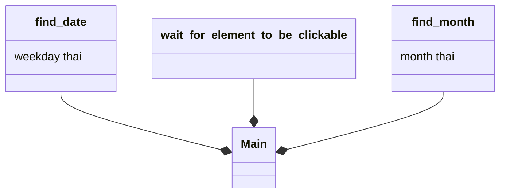

# Automatic Cudplus zoom enterer

## Things to do
    1. fill out the username and password in the first page
    2.Click Submit
    3.Click Cudplus
    4.Click Courses
    5.Click the subject that you want
    6.Click all meetings
    ~~7.Click on the latest meeting~~

    7.Click on the meeting that is the same as today
    8.Click to launch zoom tab
    9.Click launch meeting
    10.Close browser

### All done!

### Imports 
    1.webdriver_manager.chrome  - ChromeDriverManager
    2.time --> sleep
    3.selenium.webdriver.common.action_chains --> ActionChains
    4.pyautogui
    5.selenium.webdriver.common.by --> By
    6.selenium.webdriver.support.ui --> WebDriverWait
    7.selenium.webdriver.support --> expected_conditions as EC
    8.datetime

## Progress
11.36 - Add wait for element of 'ที่นี่' to be clickable
12:00 - Unable to get wait for new tab to appear
12:27 - Create the smallest delay (time.sleep()) after clicking 'always launch meetings' before closing the browser
